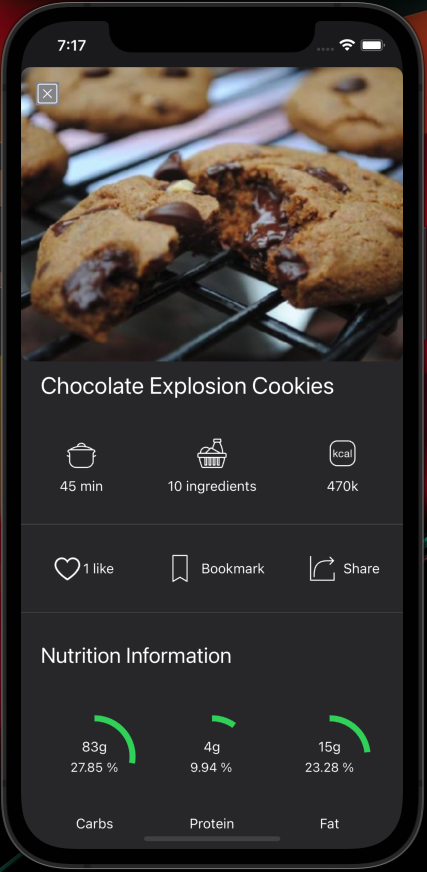

# iOS-GreenRecipes

# Introduction

This iOS app is built using Swift 5 and Xcode 12 and is designed for improving one's  Vegan and Vegetarian cooking skills by browsing recipes
across various categories.

The app consumes [Spoonacular API](https://spoonacular.com/food-api) which is a well known Food and Meal API.

# Installation

Simple clone the current repository as follows,

`git clone git@github.com:anupamberi/iOS-GreenRecipes.git`

On cloning the repo, navigate to the directory of the repo.

Launch Xcode using the following command

`open iOS-GreenRecipes.xcworkspace`

On Xcode opening, make sure that the right scheme is presented.

To do so, click on Manage Schemes to select the below scheme.

Select an IPhone Simulator and launch the app

The application can be launched using the normal Xcode app launch button and by selecting an IPhone
simulator (IPhone Simulator 8 and above, recommended IPhone Simulator 11 / 12).

# Details and Usage Instructions

## App Launch

On launching the app, a splash screen is presented.

## Home

After the launch screen,  a tabbed view  is then presented that contains three tabs for user activity.

- Home
- Search
- Profile

The home tab is shown by default and shows the recommended recipes after downloading the latest recipes across different recipe categories e.g recommendations, main course, beverages, desserts etc.

Each sections of the Home View contains horizontally scrollable views of downloaded different recipes.

## Recipe Details

For viewing the recipe details,  the user can simply click on the recipe and the recipe details are presented.

The recipe nutrition information, ingredients and detailed step by step instructions are presented to the user.

- The user can like a recipe by clicking the like button. On clicking the like button, the number of likes are incremented and the icon changes
to red heart. Similarly the user can remove the like by once again clicking the same heart icon.

- The user can bookmark a recipe by clicking the bookmark button. On bookmarking a recipe  the bookmark icon changes. The user can
similarly remove the bookmark by clicking the same icon.

- The user can share a recipe by clicking the share icon. On clicking the share icon, an activity pick controller is presented and the recipe
original source URL can be shared.

## Search Recipes

The users can search recipes using the search bar based on any keyword eg. tofu, hummus etc.
By default, some recipe categories are offered and presented in a horizontally scrolling view. By clicking a recipe category, its corresponding
recipes are downloaded and presented to the user in a vertically scrolling view.

On clicking the search bar, the recipe search categories view is hidden and the user can type and search any recipes.
The corresponding searched recipes are then then presented as shown below,

On clicking the cancel button, the previous view and recipe category and its recipes are presented to the user.

The user can subsequently re-search another recipe and the same UI behaviour repeats.

## Profile

The user profile view keeps tracks of the user's liked and bookmarked recipes and these are presented by selecting the appropriate tabs.

The liked/bookmarked recipes are shown in a vertically scrolling view. Shortcut icons for like (upper left) and bookmark (upper right) are
presented. A user may remove a like or bookmark by clicking these shortcut buttons or by opening the recipe details and doing the same.

Each of the users actions of like and bookmark are taken into account by updating the UI subsequently.

E.g The user is browsing different recipes liked previously. A recipe can be bookmarked directly by clicking the upper right bookmark icon.
This change is also reflected when he selects the bookmark tab and this newly bookmarked recipe appears.

### Profile preferences

The right upper corner navigation button presents the preferences to the user.

These preferences are for the Home and Search tabs and the user can select/deselect a particular recipe category to be presented
after launching the application.

The changes are taken into effect on the next app launch and are persisted across multiple launches. At any time, the user may change
these preferences.

# Technical Details

- UICollectionView with Compositional layout and Diffable Data Source is used across all view controller who use collection views. 
- The recipe data is saved using a CoreData stack and the CoreData model is shown below

All recipes opened using the details view along with liked and bookmarked recipes are persisted.

- In addition, the user preferences are stored in the UserDefaults and presisted across app launches.
- An activity indicator with a message is shown during backend API calls.

# Motivation

This small app was built from a personal ambition to improve cooking skills. I have studied the UI of different App Store apps in order to 
construct the UI of this app.

Some of the consulted and studies apps are :

- iTunes App
- App store
- Vegan Recipes
- Kitchen Stories Recipes
- Tasty

# Further Improvements

The app can be further improved by

- Presenting the user with a meal plan for the day.
- Refine the search using nutrition specific aspects.
- Show similar recipes button to let user explore even more recipes.

# References

[Modern Collection Views](https://developer.apple.com/documentation/uikit/views_and_controls/collection_views/implementing_modern_collection_views)
[StackOverflow](https://stackoverflow.com)
[YouTube](https://www.youtube.com)
[RayWanderlich](https://www.raywenderlich.com)
